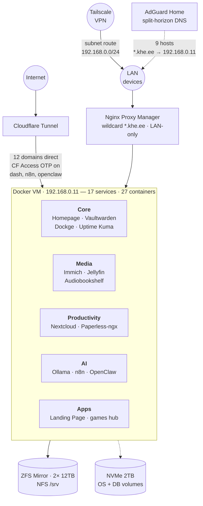

# KHE Homelab

Personal family homelab — self-hosted cloud, media, and AI on a single machine. Infrastructure as Code with Docker Compose on Proxmox VE.

## Architecture



> NPM, AdGuard, and Cloudflare Tunnel also run on the same Docker VM (shown above in the ingress tier, not listed again inside Core).

Two independent paths to the same containers:
- **External** — Cloudflare Tunnel goes directly to each container (12 public hostnames). CF Access OTP gates `dash`, `n8n`, `openclaw`. Subject to Cloudflare's 100MB upload limit.
- **LAN / Tailscale** — AdGuard rewrites 9 hostnames (`khe.ee`, `dash`, `cloud`, `vault`, `docs`, `photos`, `jellyfin`, `books`, `status`) to `192.168.0.11`, so devices hit NPM with the wildcard cert and no upload limit. `n8n`, `openclaw`, `games` have no LAN shortcut — always via CF.

Proxmox VE (192.168.0.10) is the hypervisor; the Docker VM (192.168.0.11) is the only guest. Fast storage (NVMe) holds the VM root + DB volumes; bulk storage (ZFS mirror, NFS-mounted at `/srv`) holds photos, media, documents.

## Hardware

| Component | Spec |
|-----------|------|
| CPU | Intel i7-12700K (12C/20T, Quick Sync iGPU) |
| RAM | 32GB DDR5 |
| Boot | 2TB Kingston KC3000 NVMe |
| Storage | 2x 12TB WD Ultrastar (ZFS Mirror) |
| PSU | Seasonic 850W Gold |
| Network | Intel 2.5G LAN → Asus RT-AX55 |

Intel iGPU is passed through to the Docker VM via `vfio-pci` for hardware transcoding —
Jellyfin and Immich machine-learning both use `/dev/dri` for Quick Sync acceleration.

## Services

| | Service | Domain | What it does |
|---|---------|--------|-------------|
| 🌐 | **Landing Page** | `khe.ee` | Public family landing page |
| 🏠 | **Homepage** | `dash.khe.ee` | Service dashboard with live widgets (CF Access protected) |
|  | **Nextcloud** | `cloud.khe.ee` | Files, calendar, contacts (CalDAV/CardDAV), tuned PHP/PG/Redis |
|  | **Immich** | `photos.khe.ee` | Photo library with ML tagging (Google Photos replacement) |
|  | **Vaultwarden** | `vault.khe.ee` | Password manager with Passkey support |
|  | **Jellyfin** | `jellyfin.khe.ee` | Media server with Quick Sync HW transcoding |
|  | **Paperless-ngx** | `docs.khe.ee` | Document archive with OCR (Estonian + English) |
|  | **Audiobookshelf** | `books.khe.ee` | Audiobooks and podcasts |
|  | **n8n** | `n8n.khe.ee` | Workflow automation (CF Access protected) |
|  | **Uptime Kuma** | `status.khe.ee` | Service monitoring and alerts |
|  | **OpenClaw** | `openclaw.khe.ee` | AI devops agent with sandboxed Docker access (CF Access protected) |
| 🎮 | **games hub** | `games.khe.ee` | Launcher + study-game (`/study/`), auto-deployed from GitHub |
|  | Ollama | LAN only | Local AI models (qwen2.5:7b, CPU-only) |
|  | AdGuard Home | LAN + Tailscale | DNS ad-blocking + split-horizon DNS (filters mobile data too, via Tailscale) |
|  | Dockge | LAN only | Docker Compose management UI |
|  | Nginx Proxy Manager | LAN only | Reverse proxy + wildcard SSL for LAN traffic |
|  | Cloudflare Tunnel | — | Secure external access (no open ports) |

## Security & Access

Multiple independent layers — nothing on the router is exposed to the internet.

**External access — Cloudflare Tunnel**
Zero inbound ports. Cloudflare terminates TLS and forwards to containers over an outbound-only tunnel.
Sensitive services (Homepage, n8n, OpenClaw) sit behind **Cloudflare Access** with email OTP.

**Remote admin — Tailscale VPN**
Docker VM runs Tailscale as a **subnet router** (`192.168.0.0/24`), so any Tailscale-connected
device gets full LAN access: Proxmox UI, Dockge, AdGuard, NPM admin, and SSH to the VM.
Lets mobile devices bypass the Cloudflare 100MB upload limit — large Immich / Nextcloud
uploads go directly to NPM over VPN.

**LAN access — Wildcard SSL**
A `*.khe.ee` Let's Encrypt certificate (Cloudflare DNS-01 challenge, auto-renewing) on NPM means
every LAN service gets HTTPS without per-service certs. AdGuard does split-horizon DNS, so
`photos.khe.ee` at home resolves to `192.168.0.11` — fast, unlimited uploads, never touches the internet.

**Host hardening**
- SSH key-only auth on Docker VM (password login disabled)
- UFW firewall + fail2ban on the VM
- OpenClaw's Docker access goes through `docker-socket-proxy` (read-only + restart, no exec/create)
- All secrets in `.env` files on the VM, never committed

## Resilience

Three independent layers, each catching what the others miss:

1. **Kernel hang — hardware watchdog.** The Docker VM runs the `watchdog` daemon
   pinging `/dev/watchdog` (Proxmox-emulated iTCO, 30s hardware timeout). If the
   kernel wedges — OOM, I/O lock, driver bug — the hypervisor force-resets the
   VM and Proxmox boots it back up. Conservative config: only pings the device,
   no load/memory/network checks (those cause false-positive reboots on blips).
2. **Unhealthy container — autoheal sidecar.** `willfarrell/autoheal` talks to a
   narrow-scope `docker-socket-proxy` (same pattern OpenClaw uses) and restarts
   any container whose Docker healthcheck reports `unhealthy`. Fills the gap
   left by `restart: unless-stopped`, which only reacts to full crashes. This
   caught a stuck immich-ml worker the day it was deployed.
3. **Service down — Uptime Kuma + Telegram push.** Every service has a Kuma
   HTTP/DNS monitor; all notify the same Telegram bot (`@khe_homelab_bot`,
   shared with OpenClaw). Alert lands on the owner's phone within ~90s. Kuma
   DB is in `backup.sh`, so monitor + notification config survives a VM rebuild.

## Automation

Operational work is kept to a minimum by pushing everything into code and cron.

- **GitOps** — every `docker-compose.yml`, Homepage config, AdGuard config, and OpenClaw agent workspace
  is version-controlled here. Rebuilding any service is `git pull && docker compose up -d`.
- **Renovate** — watches every pinned image tag and opens PRs for updates (digests + changelogs).
- **GitHub Actions self-hosted runner** — a runner registered on the Docker VM picks up
  jobs from the `study-game` source repo: push to `main` → Vite build → `dist/` copied to
  `/srv/data/games/study` → live in seconds. The games-hub nginx container serves that folder under `/study/`.
- **Certificate renewal** — NPM auto-renews the wildcard cert via Cloudflare DNS API. No manual steps.
- **Backup script** — `scripts/backup.sh` dumps all Postgres DBs and snapshots configs on a schedule.

## Network

```
192.168.0.1       Asus RT-AX55 (gateway, DHCP .100-.254)
192.168.0.10      Proxmox host (pve.khe.ee)
192.168.0.11      Docker VM (+ Tailscale subnet router)
192.168.0.2-99    Reserved for static devices
```

Router DHCP hands out `192.168.0.11` (AdGuard) as the **only** DNS — no secondary.
"Fallback" DNS servers sound safe but trigger happy-eyeballs racing: clients query
both in parallel and Cloudflare always wins, so ad/tracker filtering silently
bypasses AdGuard for ~80%+ of traffic. Better to fail loudly if AdGuard is down.
Tailscale admin pushes the same AdGuard DNS to remote devices, so filtering
follows phones/laptops on mobile data and foreign WiFi too.

All external traffic goes through Cloudflare Tunnel — zero ports open on the router.

## Setup

```bash
# On Proxmox host
./scripts/proxmox-post-install.sh     # 1. Disable enterprise repo, install tools, enable IOMMU
./scripts/setup-igpu-passthrough.sh   # 2. Bind Intel iGPU to vfio-pci for QSV (reboot after)
./scripts/create-zfs-pool.sh          # 3. Create ZFS mirror from 2x 12TB HDDs
./scripts/create-docker-vm.sh         # 4. Create Debian 13 VM (cloud-init, fully automated)
./scripts/setup-nfs-share.sh          # 5. Export ZFS pool via NFS

# Inside Docker VM (ssh khe@192.168.0.11)
./scripts/setup-docker-host.sh        # 6. Install Docker + real kernel + firmware (reboot after)
./scripts/mount-nfs-in-vm.sh          # 7. Mount NFS shares at /srv
./scripts/harden-docker-vm.sh         # 8. UFW firewall, fail2ban, SSH hardening
./scripts/setup-tailscale.sh          # 9. Install Tailscale as subnet router
./scripts/deploy.sh up                # 10. Start all 17 services
```

## Day-to-day

```bash
./scripts/deploy.sh status   # What's running?
./scripts/deploy.sh pull     # Pull latest images
./scripts/deploy.sh up       # (Re)start everything
./scripts/deploy.sh down     # Stop everything
./scripts/backup.sh          # Backup databases + configs
```

## Project Structure

```
services/
├── core/            NPM, AdGuard, Cloudflare, Vaultwarden, Dockge, Uptime Kuma, Homepage
├── media/           Immich, Jellyfin, Audiobookshelf
├── productivity/    Nextcloud, Paperless-ngx
├── ai/              Ollama, n8n, OpenClaw (+ workspace/ for agent config)
└── apps/            Landing Page, games hub (launcher + study-game)

infrastructure/      Proxmox, network, Cloudflare, and Tailscale documentation
scripts/             Setup, deploy, backup, and hardening scripts
```

---

*Built with [Claude Code](https://claude.ai/claude-code). Version tracking by [Renovate](https://github.com/renovatebot/renovate).*
