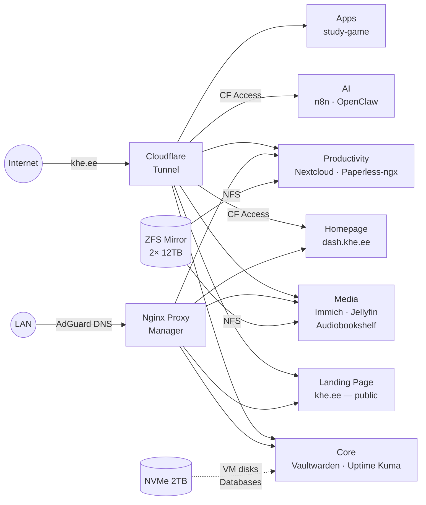

# KHE Homelab

Personal family homelab — self-hosted cloud, media, and AI on a single machine. Infrastructure as Code with Docker Compose on Proxmox VE.

## Architecture



> **Proxmox VE** (192.168.0.10) runs a single **Docker VM** (192.168.0.11) with 17 services.
> External traffic via Cloudflare Tunnel, LAN traffic via Nginx Proxy Manager (split-horizon DNS).
> Fast storage (NVMe) for OS and databases, bulk storage (ZFS mirror) via NFS for photos, media, and files.

## Hardware

| Component | Spec |
|-----------|------|
| CPU | Intel i7-12700K (12C/20T, Quick Sync iGPU) |
| RAM | 32GB DDR5 |
| Boot | 2TB Kingston KC3000 NVMe |
| Storage | 2x 12TB WD Ultrastar (ZFS Mirror) |
| PSU | Seasonic 850W Gold |
| Network | Intel 2.5G LAN → Asus RT-AX55 |

## Services

| Service | Domain | What it does |
|---------|--------|-------------|
| **Landing Page** | `khe.ee` | Public family landing page |
| **Homepage** | `dash.khe.ee` | Service dashboard (CF Access protected) |
| **Nextcloud** | `cloud.khe.ee` | Files, calendar, contacts (CalDAV/CardDAV) |
| **Immich** | `photos.khe.ee` | Photo library (Google Photos replacement) |
| **Vaultwarden** | `vault.khe.ee` | Password manager with Passkey support |
| **Jellyfin** | `jellyfin.khe.ee` | Media server (kids' cartoons, movies) |
| **Paperless-ngx** | `docs.khe.ee` | Document archive with OCR (Estonian + English) |
| **Audiobookshelf** | `books.khe.ee` | Audiobooks and podcasts |
| **n8n** | `n8n.khe.ee` | Workflow automation (CF Access protected) |
| **Uptime Kuma** | `status.khe.ee` | Service monitoring and alerts |
| **OpenClaw** | `openclaw.khe.ee` | AI devops agent (CF Access protected) |
| **study-game** | `games.khe.ee` | Study game app (auto-deploy via GitHub Actions) |
| Ollama | LAN only | Local AI models (qwen2.5:7b, CPU-only) |
| AdGuard Home | LAN only | DNS ad-blocking + split-horizon DNS |
| Dockge | LAN only | Docker Compose management UI |
| Nginx Proxy Manager | LAN only | Reverse proxy + SSL for LAN traffic |
| Cloudflare Tunnel | — | Secure external access (no open ports) |

## Network

```
192.168.0.1       Asus RT-AX55 (gateway, DHCP .100-.254)
192.168.0.10      Proxmox host (pve.khe.ee)
192.168.0.11      Docker VM
192.168.0.2-99    Reserved for static devices
```

All external traffic goes through Cloudflare Tunnel — zero ports open on the router.
Local traffic uses AdGuard split-horizon DNS to stay on LAN.

## Setup

```bash
# On Proxmox host
./scripts/proxmox-post-install.sh     # 1. Disable enterprise repo, install tools, enable IOMMU
./scripts/create-zfs-pool.sh          # 2. Create ZFS mirror from 2x 12TB HDDs
./scripts/create-docker-vm.sh         # 3. Create Debian 13 VM (cloud-init, fully automated)
./scripts/setup-nfs-share.sh          # 4. Export ZFS pool via NFS

# Inside Docker VM (ssh khe@192.168.0.11)
./scripts/setup-docker-host.sh        # 5. Install Docker, tools, create networks
./scripts/mount-nfs-in-vm.sh          # 6. Mount NFS shares at /srv
./scripts/harden-docker-vm.sh         # 7. UFW firewall, fail2ban, SSH hardening
./scripts/deploy.sh up                # 8. Start all 17 services
```

## Day-to-day

```bash
./scripts/deploy.sh status   # What's running?
./scripts/deploy.sh pull     # Pull latest images
./scripts/deploy.sh up       # (Re)start everything
./scripts/deploy.sh down     # Stop everything
./scripts/backup.sh          # Backup databases + configs
```

## Project Structure

```
services/
├── core/            NPM, AdGuard, Cloudflare, Vaultwarden, Dockge, Uptime Kuma, Homepage
├── media/           Immich, Jellyfin, Audiobookshelf
├── productivity/    Nextcloud, Paperless-ngx
├── ai/              Ollama, n8n, OpenClaw (+ workspace/ for agent config)
└── apps/            Landing Page, study-game

infrastructure/      Proxmox and network documentation
scripts/             Setup, deploy, backup, and hardening scripts
```

---

*Built with [Claude Code](https://claude.ai/claude-code). Version tracking by [Renovate](https://github.com/renovatebot/renovate).*
